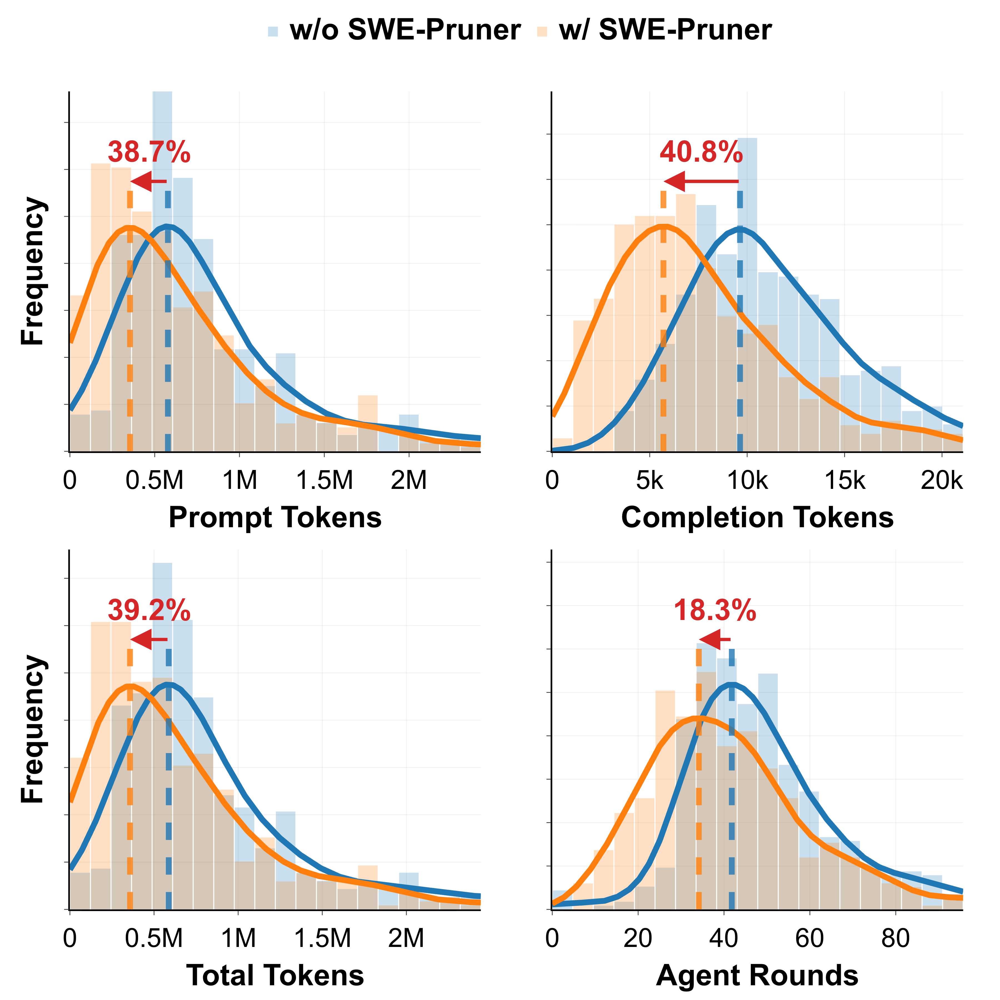
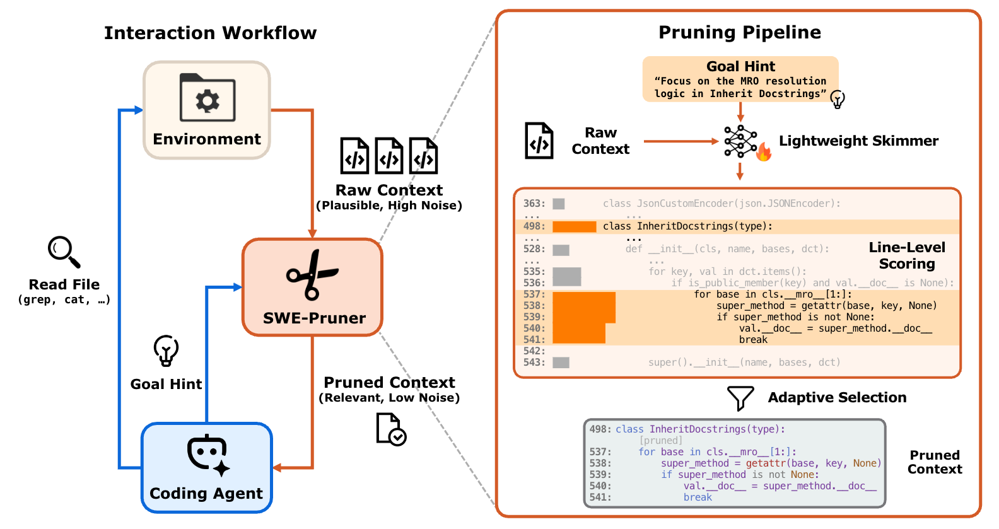

# SWE-Pruner: Self-Adaptive Context Pruning for Coding Agents

<p align="center"><b>Semantic Highlight&nbsp; ◦ &nbsp;Coding Agent Native&nbsp; ◦ &nbsp;Flexibly Use&nbsp; ◦ &nbsp;Long Context Tailored</b></p>

<p align="center"><b style="font-size: 2em;">Make Claude Tokens <span style="color: #3be040;">40% Saving</span>!</b></p>

<p align="center"></p>

<summary><h2>📢 Latest Updates</h2></summary>

**🔥 Releases:**
- 1/26/2025: Introduce **SWE-Pruner** 
  - 📖 paper: https://arxiv.org/abs/2601.16746
  - ⚙️ code: https://github.com/Ayanami1314/swe-pruner
  - 🐍 pip: https://pypi.org/project/swe-pruner/
  - 🤗 huggingface: https://huggingface.co/ayanami-kitasan/code-pruner


## 📑 Introduction to SWE-Pruner

<p align="center"></p>

Are you struggling with **excessive token costs** and latency when using LLM agents for software development? Traditional context compression approaches rely on fixed metrics like perplexity (PPL), ignoring the task-specific nature of code understanding. But **generic compression ≠ relevant preservation** — what we truly need is **task-aware context pruning** that maintains critical implementation details. When working with complex codebases that demand precise understanding and debugging capabilities, one-size-fits-all compression often breaks syntactic structures and loses essential information.

Inspired by how human programmers "selectively skim" source code during development, we propose SWE-Pruner — a self-adaptive context pruning framework specifically designed for coding agents. It enables agents to formulate explicit goals that guide intelligent context pruning, using a lightweight neural skimmer to **dynamically select relevant code lines**. This approach mimics how experienced developers navigate through codebases, focusing only on what matters for the current task. SWE-Pruner operates in two key steps:

- Formulate task-specific goals to guide the pruning process
- Dynamically select relevant code lines using a lightweight neural skimmer

## 🎯 Core Features

**🧠 Task-Aware Pruning**
Moves beyond generic metrics like perplexity. SWE-Pruner understands the *intent* behind a coding task, allowing the agent to formulate explicit goals (e.g., "focus on error handling") that intelligently guide the context pruning process.

**🤖 Coding Agent Native**
Specifically designed for the multi-turn, interactive workflows of modern coding agents. It seamlessly integrates into the agent's decision loop, providing just-in-time context to enhance performance on complex software engineering tasks.

**🎨 Semantic Highlight**
Employs a lightweight 0.6B parameter neural skimmer trained to identify and preserve semantically critical lines of code. This ensures that logical structures and implementation details remain intact, preventing the information loss common in traditional compression.

**⚡ Extreme Compression**
Delivers significant token savings without sacrificing performance. Achieve 23-54% token reduction on complex agent tasks like SWE-Bench Verified and up to 14.84x compression on single-turn tasks like LongCodeQA, dramatically cutting API costs and latency.

**🔧 Flexibly Use**
A lightweight and adaptable framework that can be easily integrated with various LLMs and coding agents. Its flexible design allows it to be applied across a wide range of scenarios, from debugging to feature development.

## 🌲 Project Structure
```text
.
├── data/                      # Experiment trace archives and hyperparameter configurations
├── downstream_eval/           # Downstream evaluation benchmarks
│   ├── multi_turn/            # Includes: SWE-bench, SWEQA (coming soon)
│   └── single_turn/           # Includes: LongCodeQA, LCC (LongCodeCompletion)
├── swe-pruner/                # Inference code and model utilities
│   └── model/                 # Model files for SWE-Pruner
├── examples                   # Examples for integrating with other agents like claude code and openhands
```

## 🧰 Prerequisites

This project uses `uv` for fast and efficient dependency management.

## 🎮 Quick Start

Go to [Inference Tutorial](./swe-pruner/README.md) and have a try!


## ⚙️ Installation

Since different modules have different dependencies, please refer to the specific `README` file inside each subfolder for detailed installation instructions.

## 📖 User Guides

- For Users, look [Inference Tutorial](./swe-pruner/README.md) to start a swe-pruner locally and then reading [real world examples](examples/README.md) for agents integration.

- For Developers, look `./train`(coming soon) for training a pruner by yourself!

- For Researchers, `./downstream_eval` has some scripts for reproducing our results. We recommend to use [slurm](https://github.com/SchedMD/slurm) with at least 4 GPU to reuse our scripts.


## 🔮 Coming Soon
- [ ] 💻 Update Training Code
- [ ] 📁 Upload full parameters and trajectory files & logs
- [ ] 🤗 Update HuggingFace model card
- [ ] 🤗 Update HuggingFace blog to introducing our  technical approach in detail.
- [x] 🎮 Update agents integrate demo


## 📜 Citation
```
@misc{wang2026sweprunerselfadaptivecontextpruning,
      title={SWE-Pruner: Self-Adaptive Context Pruning for Coding Agents}, 
      author={Yuhang Wang and Yuling Shi and Mo Yang and Rongrui Zhang and Shilin He and Heng Lian and Yuting Chen and Siyu Ye and Kai Cai and Xiaodong Gu},
      year={2026},
      eprint={2601.16746},
      archivePrefix={arXiv},
      primaryClass={cs.SE},
      url={https://arxiv.org/abs/2601.16746},
}
```


## 🏆 Acknowledgements
- Bytedance Douyin Team for advises.
- Alibaba Qwen Team for open-source models.