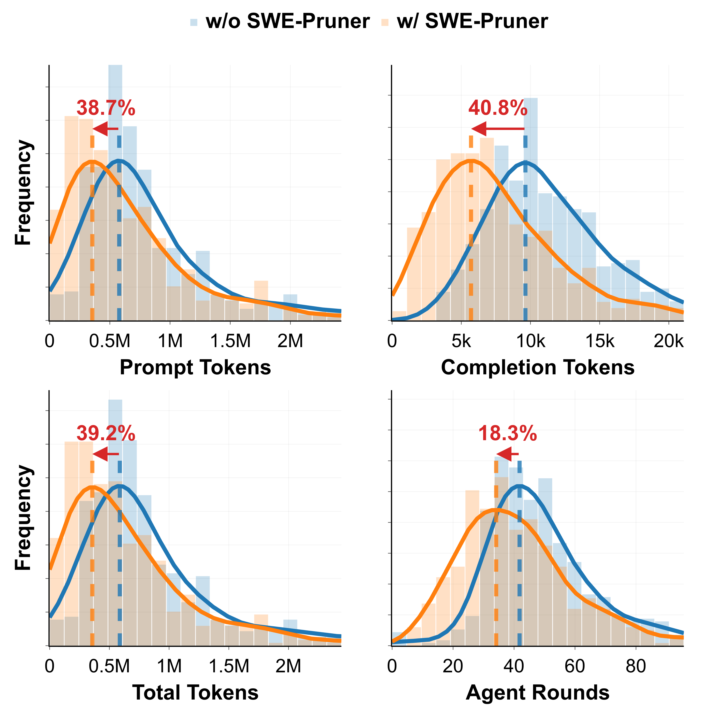
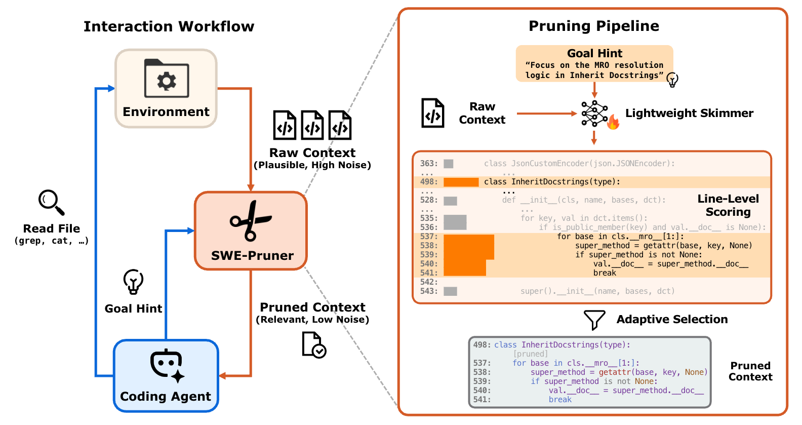

# SWE-Pruner: Self-Adaptive Context Pruning for Coding Agents

<div align="center">

[](https://arxiv.org/abs/2601.16746)
[](https://github.com/Ayanami1314/swe-pruner)
[](https://pypi.org/project/swe-pruner/)
[](https://huggingface.co/ayanami-kitasan/code-pruner)
[]()
[]()
[](https://www.notion.so/Yuhang-Wang-s-LLMSE-articles-2f0b0995619480d09880e9668338651e)
</div>

<p align="center"><b>Semantic Highlight&nbsp; ◦ &nbsp;Coding Agent Native&nbsp; ◦ &nbsp;Flexibly Use&nbsp; ◦ &nbsp;Long Context Tailored</b></p>

<p align="center"><b style="font-size: 1.2em;">Make Claude Tokens <span style="color:#FF702D;">40% Saving</span>!</b></p>

<p align="center"></p>

<summary><h2>📢 Latest Updates</h2></summary>

**🔥 Releases:**
- 3/8/2026: We update our evaluation pipeline for SWE-QA benchmark! see `downstream_eval/multi_turn/sweqa`
- 1/28/2026: We release some scripts for optimize and visualize the result! see `./utils`
- 1/27/2026: We published our tech blogs: `Towards Real-World Software Agents: How we push Semantic Highlight feature to Agentic Coding?`
  - 📄 [Towards Real-World Software Agents: How we push Semantic Highlight feature to Agentic Coding? ](https://www.notion.so/Towards-Real-World-Software-Agents-How-we-push-Semantic-Highlight-feature-to-Agentic-Coding-2f5b099561948096b911c9e1043b8e11)
  - 📄 [迈向真实世界的软件智能体：如何将语义高亮功能融入智能体编程？](https://www.notion.so/2f5b0995619480ff8bc5edce30de6b92)
- 1/26/2025: Introduce **SWE-Pruner**
  - 📖 paper: https://arxiv.org/abs/2601.16746
  - ⚙️ code: https://github.com/Ayanami1314/swe-pruner
  - 🐍 pip: https://pypi.org/project/swe-pruner/
  - 🤗 huggingface: https://huggingface.co/ayanami-kitasan/code-pruner


## 📑 Introduction to SWE-Pruner

<p align="center"></p>

Are you struggling with **excessive token costs** and latency when using LLM agents for software development? Traditional context compression often relies on fixed metrics like perplexity (PPL) and ignores task-specific code understanding. But **generic compression ≠ relevant preservation** — we need **task-aware context pruning** that retains critical implementation details.

Inspired by how human programmers "selectively skim" source code, **SWE-Pruner** enables agents to formulate explicit goals and uses a lightweight neural skimmer to **dynamically select relevant code lines**. It operates in two key steps:
- Formulate task-specific goals to guide the pruning process
- Dynamically select relevant code lines using a lightweight neural skimmer

## 🎯 Core Features

**🧠 Task-Aware Pruning**
  Understands the *intent* (e.g., "focus on error handling") and uses it to guide context pruning process, beyond generic metrics.

**🤖 Coding Agent Native**
  Built for multi-turn workflows and integrates seamlessly into agent decision loops, providing just-in-time context for complex software engineering tasks.

**🎨 Semantic Highlight**
  A lightweight [0.6B model](https://huggingface.co/ayanami-kitasan/code-pruner) identifies and preserves semantically critical lines of code, keeping logical structures intact.

**⚡ Extreme Compression**
  Delivers significant token savings without sacrificing performance: **23-54%** token reduction on [SWE-Bench Verified](https://openai.com/index/introducing-swe-bench-verified/) and up to **14.84x** compression on [LongCodeQA](https://github.com/Zteefano/long-code-bench), cutting API costs and latency.

**🔧 Flexibly Use**
  Adaptable framework for various LLMs and scenarios, from debugging to feature development.

## 🌲 Project Structure
```text
.
├── data/                      # Experiment trace archives and hyperparameter configurations
├── downstream_eval/           # Downstream evaluation benchmarks
│   ├── multi_turn/            # Includes: SWE-bench, SWEQA (coming soon)
│   └── single_turn/           # Includes: LongCodeQA, LCC (LongCodeCompletion)
├── swe-pruner/                # Inference code and model utilities
│   └── model/                 # Model files for SWE-Pruner
├── examples                   # Examples for integrating with other agents like claude code and openhands
```

## 🧰 Prerequisites

This project uses [uv](https://docs.astral.sh/uv/) for fast and efficient dependency management.

## 🎮 Quick Start

Go to [Inference Tutorial](./swe-pruner/README.md) and have a try!

> Tips: For easier serving and reproducing, we upload our models in `./swe-pruner/model` directory(tracked by git lfs). It make the serving more simple but greatly increase the repo size if you use `git clone` directly without lfs config (and might failed to download model for traffic limit of github lfs service). However, you can use the methods in the tutorial to download it from HuggingFace.

## ⚙️ Installation

Since different modules have different dependencies, please refer to the specific `README` file inside each subfolder for detailed installation instructions.

## 📖 User Guides

- For Users, look [Inference Tutorial](./swe-pruner/README.md) to start a swe-pruner locally and then reading [real world examples](examples/README.md) for agents integration.
  - We now support [OpenHands](https://github.com/OpenHands/OpenHands) and [Claude Agent SDK](https://github.com/anthropics/claude-agent-sdk-python)!

- For Developers, look `./train`(coming soon) for training a pruner by yourself!

- For Researchers, `./downstream_eval` has some scripts for reproducing our results. We recommend to use [slurm](https://github.com/SchedMD/slurm) with at least 4 GPU to reuse our scripts.

## 🧪 Utils Scripts
We provide some utils scripts for continue improving the swe-pruner in `./utils`, just look `utils/README.md`!

## 🔮 Coming Soon
- [ ] 💻 Update Training Code of SWE-Pruner
- [ ] 📁 Upload full parameters and trajectory files & logs
- [ ] 📁 Upload Training Dataset of SWE-Pruner
- [x] 📁 Upload SWE-QA evaluation code
- [x] 🤗 Update HuggingFace model card
- [x] 🤗 Update HuggingFace blog to introducing our  technical approach in detail.
- [x] 🎮 Update agents integrate demo


## 📜 Citation
```
@misc{wang2026sweprunerselfadaptivecontextpruning,
      title={SWE-Pruner: Self-Adaptive Context Pruning for Coding Agents}, 
      author={Yuhang Wang and Yuling Shi and Mo Yang and Rongrui Zhang and Shilin He and Heng Lian and Yuting Chen and Siyu Ye and Kai Cai and Xiaodong Gu},
      year={2026},
      eprint={2601.16746},
      archivePrefix={arXiv},
      primaryClass={cs.SE},
      url={https://arxiv.org/abs/2601.16746},
}
```


## 🏆 Acknowledgements
- Bytedance Douyin Team for advises.
- Alibaba Qwen Team for open-source models.

## ⭐ Star History
[](https://star-history.com/#Ayanami1314/swe-pruner&Date)