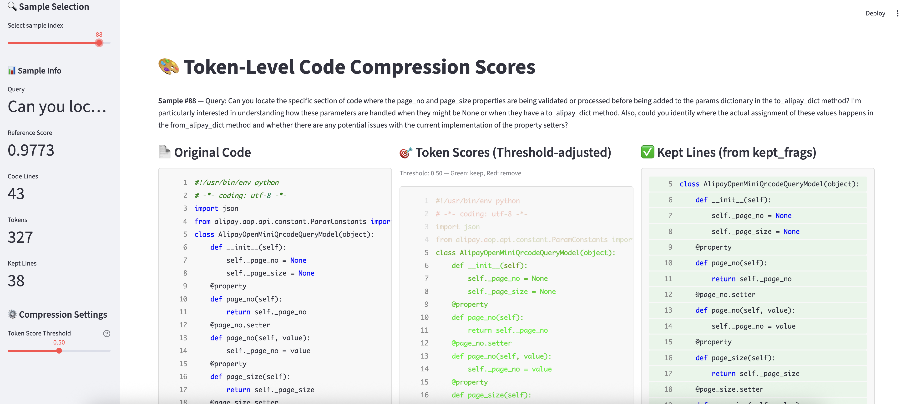

This directory contains useful scripts.

## Visualization

### Token visualization (`token_vis.py`)

Requires `streamlit`.

1. Install: `pip install streamlit`
2. Run: `streamlit run utils/token_vis.py`
3. Upload a JSONL dataset (structure described at the top of `token_vis.py`)

You get a UI where:
- **Left** — Original code
- **Middle** — Pruned code by token score (greener = higher score)
- **Right** — Ground truth (kept lines)

Use the **Compression Settings** slider to see how the threshold affects pruning.



---

## Threshold optimizer (`threshold_optimizer.py`)

Finds the **optimal score threshold** for code compression by maximizing a metric (IoU, F1, precision, or recall) against ground-truth kept lines. Optionally plots a **Pareto curve** (compression rate vs F1).

**Input:** A JSONL file where each line is a JSON object with:
- `code`: full source code string
- `token_scores`: list of `[token_str, score]` (score in [0, 1])
- `kept_frags`: list of 1-based line numbers to keep (ground truth)

**Dependencies:** `numpy`, `scipy`. For Pareto plotting: `plotly`.

### Basic usage

```bash
# Find optimal threshold (default: maximize F1, compare mean and max pooling)
python utils/threshold_optimizer.py path/to/eval_with_token_scores.jsonl

# Choose metric and pooling
python utils/threshold_optimizer.py data.jsonl --eval-metric iou --pooling mean

# Grid search instead of scipy (e.g. for reproducibility)
python utils/threshold_optimizer.py data.jsonl --method grid --grid-resolution 200
```

### Pareto curve (compression vs F1)

```bash
# Save interactive HTML: compression rate vs F1, with Pareto frontier
python utils/threshold_optimizer.py data.jsonl --plot-pareto --pareto-output pareto.html
```

### Options

| Option | Description | Default |
|--------|-------------|---------|
| `--eval-metric` | Metric to maximize: `iou`, `f1`, `precision`, `recall` | `f1` |
| `--method` | Search: `scipy` or `grid` | `scipy` |
| `--pooling` | Line score: `mean`, `max`, or `both` (compare both) | `both` |
| `--threshold-min`, `--threshold-max` | Search range | 0.0, 1.0 |
| `--grid-resolution` | Number of grid points when `--method grid` | 100 |
| `--plot-pareto` | Generate Pareto curve HTML | off |
| `--pareto-output` | Output path for Pareto plot | `pareto_curve.html` |
| `--pareto-num-thresholds` | Points for Pareto curve | 100 |

The script prints the optimal threshold and score for each pooling method, and (if `--pooling both`) which pooling is best. With `--plot-pareto`, it writes an interactive Plotly HTML file.

---

## Score distribution analysis (`score_distribution_analysis.py`)

Validates whether the CRF layer produces **bimodal** (polarized) line-level scores and evaluates threshold sensitivity via an ablation study.

**What it does:**

1. Reads a validation JSONL dataset (`query`, `code`, `score`, `kept_frags`).
2. Calls the running inference service (`/prune` endpoint) to obtain `token_scores` for each sample.
3. Computes line-level scores and plots a **histogram** (overall + split by ground-truth keep/prune label).
4. Runs a **threshold ablation** at τ ∈ {0.3, 0.5, 0.7} (customizable), reporting F1, IoU, precision, recall, and compression rate.
5. Optionally saves an enriched JSONL with `token_scores` for reuse by `threshold_optimizer.py` / `token_vis.py`.

**Dependencies:** `requests`, `numpy`. For histograms: `plotly`.

### Prerequisites

The inference service must be running:

```bash
# Start the inference service (see online_serving.py)
python -m swe_pruner.online_serving serve --model-path /path/to/model
```

### Basic usage

```bash
# Run full analysis: call inference, plot histogram, print ablation table
python utils/score_distribution_analysis.py eval_ds_enhanced-shuf-small.jsonl

# Custom thresholds
python utils/score_distribution_analysis.py eval_ds_enhanced-shuf-small.jsonl \
    --thresholds 0.2 0.3 0.4 0.5 0.6 0.7 0.8

# Save enriched JSONL for later reuse (skip inference next time)
python utils/score_distribution_analysis.py eval_ds_enhanced-shuf-small.jsonl \
    --save-enriched eval_enriched.jsonl

# Re-run analysis without calling inference (reuse enriched JSONL)
python utils/score_distribution_analysis.py eval_enriched.jsonl --skip-inference
```

### Options

| Option | Description | Default |
|--------|-------------|---------|
| `--base-url` | Inference service URL | `http://localhost:8000` |
| `--thresholds` | Threshold values for ablation | `0.3 0.5 0.7` |
| `--pooling` | Line score pooling: `mean`, `max`, or `both` | `both` |
| `--histogram-output` | Output path for histogram HTML | `score_histogram.html` |
| `--num-bins` | Number of histogram bins | `50` |
| `--save-enriched` | Save enriched JSONL with token_scores | off |
| `--skip-inference` | Skip API calls (requires pre-enriched JSONL) | off |
| `--timeout` | HTTP timeout per request (seconds) | `120` |
| `--quiet` | Suppress per-sample progress | off |

### Output

- **Histogram** (`score_histogram.html`): Interactive Plotly chart showing line-level score distribution. If bimodal, most scores cluster near 0 and 1, validating that the CRF layer polarizes predictions.
- **Ablation table**: ASCII table printed to stdout showing how F1, IoU, precision, recall, and compression rate vary across thresholds. Low variance across τ values confirms threshold robustness.
